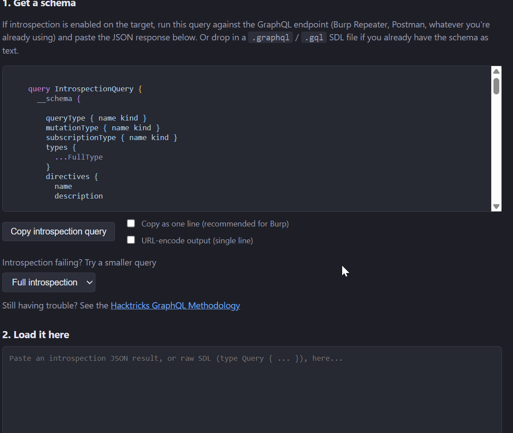

# Grepql

Grepql is a tool for quickly exploring GraphQL schemas and building queries and mutations from the fields and arguments they expose.



While similar tools like Apollo Sandbox/Explorer exist, building them locally requires a more involved setup, and the resulting app still makes telemetry requests to Apollo's servers unless those requests are blocked separately downstream, which is even more work. That's not ideal when working with client applications during a penetration test.

Grepql takes the opposite approach. It's a single-page, pure HTML/CSS/JS app with no account, web server, required build steps, or outbound telemetry requests to work around, and it was built with penetration testing in mind.

## Installation

Grepql is a static HTML/JS application, so there's nothing to install or build:

```bash
git clone https://github.com/sam-howle/grepql.git
```

Then open `index.html` in your favorite web browser.

If you just want to give it a quick spin, there's also a hosted version at [sam-howle.github.io/grepql](https://sam-howle.github.io/grepql/). It runs entirely client-side and is intended as a convenient way to try out Grepql's functionality without cloning the repository.

A sample introspection response is included at [`examples/sample-introspection.json`](examples/sample-introspection.json) if you need something to test it with.

For actual engagement use, running Grepql locally is recommended, particularly when working with clients' schemas or other sensitive data. The hosted version doesn't send that data anywhere either, but running Grepql locally lets you review the exact code once and know it won't change underneath you.

## Using it

1. Paste or upload a schema. Introspection JSON results, SDL text (including output from tools like [Clairvoyance](https://github.com/y0k4i-1337/clairvoyancex)), and `.graphql`/`.gql` files are all accepted.
2. Search through the schema and build a query or mutation in the GUI, filling in argument fields as needed.
3. Copy the generated query.
4. Feed it to Burp, Postman, curl, or whatever you're already using.
5. Send the request.

The landing page includes full and reduced introspection queries for getting started.

 A few things worth knowing up front:

- The field tree supports interfaces, unions (with inline-fragment pickers per concrete type), and arbitrarily deep nesting. The filter box searches the whole schema and auto-expands to any match, not just what's currently visible.
- Argument values are written as real GraphQL literals, not JSON, and scalar args are type-checked as you type.
- **Query** and **Mutation** each get their own tab with independent selection state.
- **Copy as one line** strips real newlines for pasting into a Repeater body or a curl `-d` flag. **URL-encode output (single line)** does both steps at once (for sending the query as a `?query=` GET param).

## Data persistence

Grepql doesn't save anything between sessions by default. If you close or refresh the page, the loaded schema and any query or mutation you were working on are gone.

If you want Grepql to remember your work between sessions, you can enable **Save schema between sessions** in **Settings**. When enabled, Grepql stores the loaded schema and your current query/mutation state in the browser's `localStorage`. This data stays on your machine and is never sent anywhere.

Autosave is off by default because `localStorage` doesn't support real expiration. Grepql can associate an expiration time with saved data, but it can only check that expiration when the page is opened again. If the configured expiration is 24 hours and you don't reopen Grepql for a week, the data will still be sitting in `localStorage` until you open the page again or clear it manually.

Cookies would solve that particular problem because browsers can enforce a cookie's expiration without Grepql needing to run. However, cookie behavior for local `file://` pages isn't consistent across browsers, so they aren't reliable for a tool that's designed to run by opening `index.html` directly.

If you enable autosave, the default expiration is 24 hours after the last save. You can change the expiration period in **Settings**. When Grepql is opened, expired data is deleted instead of being restored.

You can also clear saved data at any time using **Delete cached schema data** in **Settings**. Turning **Save schema between sessions** off will clear the saved data as well.

Since schemas from real engagements may contain client information, it's a good idea to treat Grepql's saved data the same way you treat Burp history or other testing-browser data for that engagement. If you use Grepql in the same browser or browser profile you use for testing, clearing that profile's site data when the engagement is finished also gives you one place to clean everything up.

For browser-level cleanup, clearing the normal browser cache alone does not remove `localStorage`. In Chrome, it falls under **Cookies and other site data**. In Firefox, it falls under **Offline Website Data**.

## Argument input notes

- Scalars (`String`, `Int`, `Float`, `ID`, custom scalars) get a plain text box. Strings are auto-quoted for you.
- Enums and `Boolean` get a dropdown, so the value is always valid.
- Lists of scalars accept comma-separated values (`a, b, c`), or you can type the full `[ ... ]` literal yourself if you need something more specific.
- `INPUT_OBJECT`-typed arguments get one typed widget per field of the input type: the same text/number/enum-dropdown/boolean-dropdown/list-textarea widgets used for top-level arguments, recursing into nested input objects the same way the tree recurses into nested selections. Each field is validated and gets its own "required" indicator, same as top-level arguments. Every input-object level has an **Edit as raw text** link if you'd rather type the GraphQL literal yourself (for example, a variable reference, or something the structured widgets don't cover). Switching to raw mode pre-fills with whatever you'd already entered in the structured fields, and switching back preserves those fields untouched.
- A list of input objects (e.g. `[CreatePostInput!]!`) is the one case that's still a free-text box rather than structured widgets. A repeatable add/remove-item UI for that would be more than this needed so far. It's pre-filled with a generated skeleton literal (e.g. `[{ title: "", body: "", ... }]`) as a starting point.

## Updating the bundled GraphQL version

`vendor/graphql-bundle.js` is built from `graphql-js` 16.14.2 (the `^16.9.0` range pinned in `build/package.json`). It's just a handful of parsing/introspection functions, so this doesn't need to track every graphql-js release. You only need to touch it if you specifically want whatever a newer graphql-js version added, like support for a newer part of the GraphQL spec, or a parser bugfix, and the version in this repo hasn't been bumped to include it yet.

To update it:

1. Bump the `graphql` version in `build/package.json`.
2. Regenerate the bundle:
   ```
   cd build
   npm install
   node_modules/.bin/esbuild entry.js --bundle --minify --format=iife --outfile=../vendor/graphql-bundle.js
   ```
3. Commit the updated `vendor/graphql-bundle.js`.

## Known limitations

- Missing / invalid required-argument warnings are informational only, not blocking.
- Lists of input objects don't get structured per-item widgets. See above.